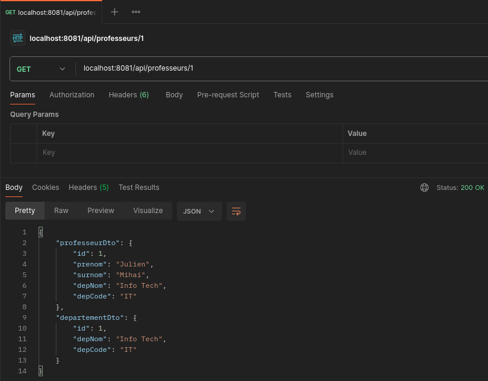

## Professeur Microservice


#### Communication avec Spring Cloud OpenFeign

Ajouter la dépendance Spring Cloud OpenFeign:

```xml
<dependency>
    <groupId>org.springframework.cloud</groupId>
    <artifactId>spring-cloud-starter-openfeign</artifactId>
</dependency>
```
Ajouter l’annotation `@EnableFeignClients` dans la classe principale `ProfesseurMicroserviceApplication`

Créer un Feign API Client (linterface `APIClient`) et modifier le service `ProfesseurServiceImpl` en appelant l'API 
fournie par le micro service Département (pour le nom).

Tester:

