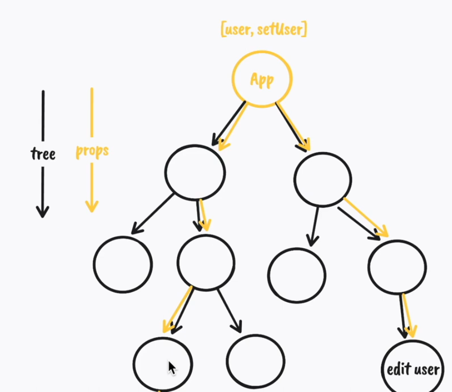
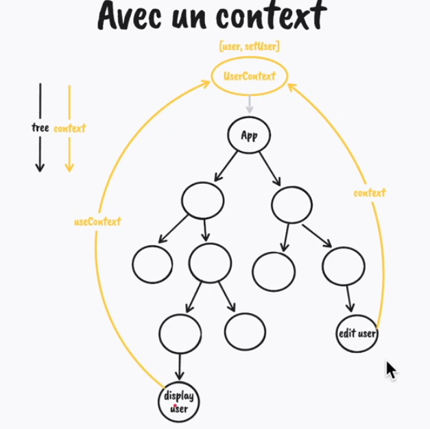

# useContext

### le problème du prop drilling

Dans la plupart des applications React :

- il ne suffit pas de lire les valeurs du contexte ;

- il est presque toujours nécessaire de les mettre à jour.

Ces mises à jour proviennent souvent de composants situés loin du haut de l’application. Par exemple : un bouton de changement de thème dans un panneau de paramètres, un bouton de déconnexion dans un menu utilisateur ou un sélecteur de langue dans le pied de page.

Ces composants sont généralement imbriqués à plusieurs niveaux, mais ils doivent tout de même modifier des données qui affectent l’ensemble de l’application.

